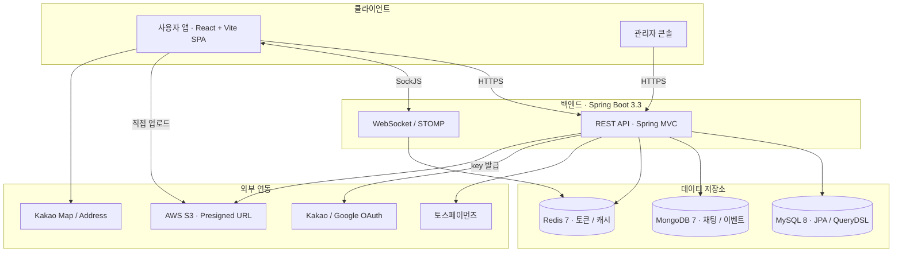
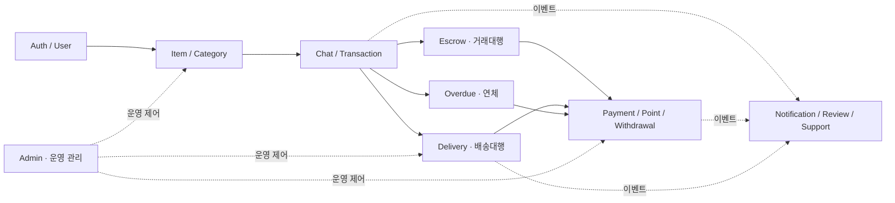
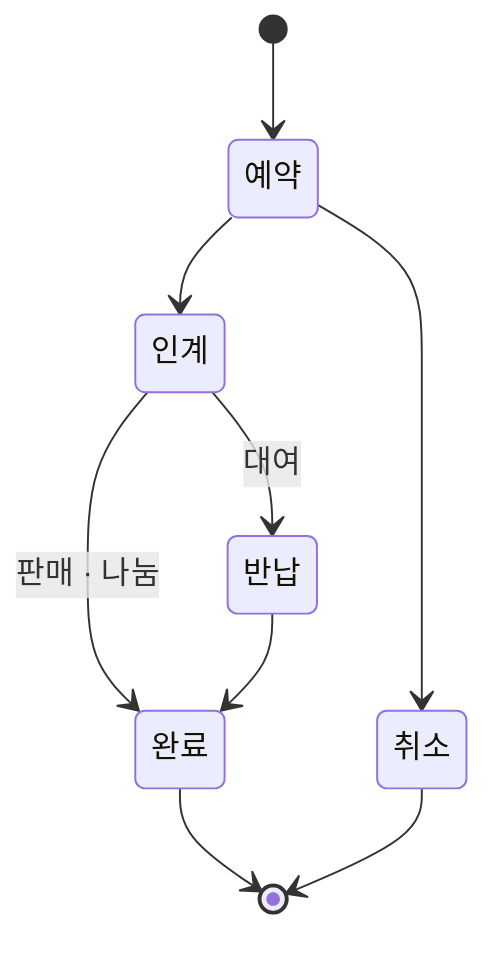
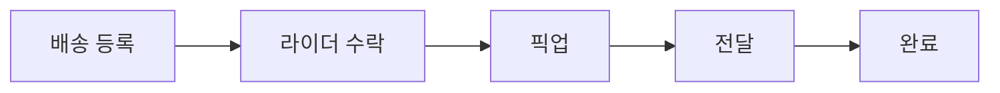

<div align="center">

<!-- 로고: docs/assets/logo.png 생성 후 아래 한 줄 주석 해제 (권장 512×512, 배경 투명)

-->


### 중고 거래 · 대여 · 나눔 · 배달대행을 하나로 묶은 C2C 통합 플랫폼

[](https://api.sseulang.store)
[](https://api.sseulang.store/swagger-ui.html)
[](.)
[](.)
[](.)
[](.)
[](.)

</div>

---

## 프로젝트 개요

물건을 **팔고 · 빌려주고 · 나누고**, 직접 만나기 어려우면 **배달대행 라이더가 대신 전달**하는 C2C 마켓입니다.
한 거래 안에서 결제 · 정산 · 배달 · 채팅이 끊김 없이 이어지도록 설계했습니다.

### 핵심 기능

| 기능 | 설명 |
|---|---|
| **3가지 거래** | 판매 / 대여 / 나눔. 하나의 물품에 복수 거래유형 등록 가능 |
| **거래대행** | 라이더가 픽업 → 배송 → 대여 반납까지 양방향 대행 |
| **충전식 머니** | 토스페이먼츠 실연동, 보증금 hold / 정산 / 환불 자동화 |
| **연체 시스템** | 반납 지연 시 보증금 차감 → 채무 누적 → 계정 정지 자동 처리 |
| **실시간** | WebSocket + STOMP 기반 채팅, 알림, 라이더 위치 트래킹 |
| **인증** | 카카오 / 구글 OAuth + 이메일 인증, JWT + Refresh Rotation |

### 전체 기술 스택

| 영역 | 스택 |
|---|---|
| **Backend** | `Java 21` · `Spring Boot 3.3` · `JPA + QueryDSL` · `MySQL 8` · `MongoDB 7` · `Redis 7` · `WebSocket/STOMP` |
| **Frontend** | `React 18` · `TypeScript` · `Vite` · `React Router` · `TanStack Query` · `Zustand` · `Axios` · `Tailwind CSS` |
| **Integration** | `토스페이먼츠` · `AWS S3 Presigned URL` · `SockJS/STOMP` · `Kakao Map/Address` · `Docker Compose` · `GCP` |

### 시스템 아키텍처



클라이언트는 REST와 WebSocket 두 채널로 백엔드와 통신하고, 이미지는 presigned URL을 발급받아 S3로 직접 업로드합니다.

### 저장소

| 저장소 | 설명 |
|---|---|
| **sl-server** | 백엔드. REST API + WebSocket, 49개 유스케이스 / 14개 도메인 |
| **sl-client** | 프론트엔드. Vite + React + TypeScript SPA, 사용자 앱 + 관리자 콘솔 |

---

## 백엔드

백엔드는 **Spring Boot 기반 REST API + WebSocket 서버**입니다.
거래, 결제, 포인트, 배송대행, 거래대행, 채팅, 알림, 관리자 기능을 도메인별로 분리하고, 결제/정산/연체처럼 상태 전이가 중요한 영역은 테스트 우선으로 검증합니다.

### 백엔드 구성

| 영역 | 스택 |
|---|---|
| **API** | Spring MVC 기반 REST API, 공통 응답 `{ success, data, error }` |
| **Persistence** | MySQL 8 + JPA/QueryDSL, 채팅/이벤트성 데이터는 MongoDB 7 활용 |
| **Cache/Session** | Redis 7 기반 refresh token rotation, blacklist, 실시간 보조 데이터 |
| **Realtime** | WebSocket/STOMP로 채팅, 알림, 배송 위치 이벤트 전송 |
| **Payment** | 토스페이먼츠 충전/승인, 포인트 정산, 보증금 hold/반환 |
| **File** | AWS S3 presigned URL 발급 후 클라이언트 직접 업로드 |
| **Infra** | Docker Compose, GCP 배포 환경 |

설계 원칙은 **DDD-lite** (Aggregate / VO / DomainEvent / Repository 인터페이스 분리) 와
영역별 강도를 차등한 **TDD** 입니다. 보안 · 결제 · 포인트 · 동시성 코드는 구현 전 테스트(RED)를 먼저 작성합니다.

### 주요 백엔드 도메인



거래 라이프사이클은 `물품 → 채팅/거래 → 거래대행·배송대행 → 정산` 순으로 이어지고, 알림과 운영 관리는 모든 도메인을 가로지르는 공통 영역입니다.

| 도메인 | 역할 |
|---|---|
| **Auth/User** | 이메일 로그인, 카카오/구글 OAuth, 이메일 인증, JWT 쿠키 세션, 사용자 프로필 |
| **Item/Category** | 물품 등록/수정/조회, 이미지 관리, 찜, 검색/필터 |
| **Chat/Transaction** | 채팅방/메시지, 직접 거래 생성, 예약/인계/반납/완료 상태 전이 |
| **Payment/Point/Withdrawal** | 포인트 충전, 사용/보관 잔액, 출금 신청, 정산 내역 |
| **Delivery** | 배송대행 모집, 라이더 수락, 픽업/전달/완료, 위치 추적 |
| **Escrow** | 거래대행 링크/신청/결제/수령/인계/반납/취소 합의 |
| **Overdue** | 대여 반납 지연 감지, 보증금 차감, 채무 누적, 계정 제한 |
| **Notification/Review/Support** | 실시간 알림, 리뷰, 공지, FAQ, 1:1 문의 |
| **Admin** | 회원/물품/신고/배송/출금/거래대행/연체/콘텐츠 운영 관리 |

---

## 프론트엔드

프론트는 **Vite + React + TypeScript 기반 SPA** 입니다.
도메인별 화면을 빠르게 탐색할 수 있도록 라우트를 세분화하고, 서버 상태는 TanStack Query, 인증/채팅/드로어 같은 클라이언트 상태는 Zustand로 관리합니다.

```text
src/
├── app/        # Router, Provider, STOMP Provider
├── pages/      # 라우트 단위 화면
├── features/   # 도메인별 api, hook, type, 컴포넌트
├── shared/     # 공통 api/lib/store/types/ui
└── styles/     # 전역 Tailwind CSS
```

| 영역 | 구현 내용 |
|---|---|
| **라우팅** | React Router `createBrowserRouter`, lazy import 기반 코드 스플리팅, 공개/로그인/관리자 라우트 가드 |
| **인증** | HttpOnly 쿠키 기반 JWT 세션, CSRF 헤더 자동 첨부, Access Token 만료 시 refresh 후 원 요청 재시도 |
| **데이터 통신** | 공통 Axios 인스턴스에서 `{ success, data, error }` 응답 unwrap, 도메인별 `features/*/api.ts` 분리 |
| **실시간** | SockJS + STOMP로 채팅 메시지, 알림, 라이더 위치 트래킹 수신 |
| **결제/포인트** | 토스페이먼츠 충전 callback, 포인트 잔액/내역, 출금 신청, 거래대행 포인트 결제 화면 |
| **이미지 업로드** | presigned URL 발급 → S3 PUT → 도메인 API에 key/URL 전달 |
| **운영 도구** | 회원, 물품, 신고, 공지, 배너, 배송, 출금, 거래대행, 연체를 관리하는 관리자 콘솔 |

### 주요 화면

| 화면군 | 대표 기능 |
|---|---|
| **홈/물품** | 메인 배너, HOT/대여/판매 섹션, 카테고리·검색·가격·거래유형 필터, 물품 등록/수정 |
| **채팅/거래** | 채팅방 목록/대화, 거래 생성, 예약·인계·반납·완료 상태 전이 |
| **거래대행** | 외부 링크 발급, 초대 신청, 내부 채팅 신청, 수수료 미리보기, 구매자 정보 입력, 결제, 수령/인계/반납 확인 |
| **배송대행** | 배송 등록, 라이더 수락/픽업/전달/완료, 실시간 위치 지도 |
| **마이페이지** | 프로필 수정, 내 물품, 찜, 차단, 거래 상세, 연체 정보, 문의 내역 |
| **알림/리뷰/지원** | 알림 목록·읽음 처리, 리뷰 작성/관리, 공지·FAQ·1:1 문의 |
| **관리자** | 대시보드, 회원/탈퇴/오늘가입, 거래/물품/신고, 배송/출금/보증금, 공지/배너/문의, 거래대행 수수료 설정 |

### 거래 흐름

물품 거래는 정해진 상태 전이로 관리되고, 직접 만나기 어려우면 배달대행 라이더가 인계를 대신합니다.

**직접 거래 상태 전이**



**배달대행 라이더 흐름**



대여 거래는 전달 이후 반납 단계가 추가되며, 반납 수거도 같은 라이더 흐름으로 진행됩니다.

### 연동 문서

프론트 연동 상세는 [`docs/FRONTEND_INTEGRATION.md`](./FRONTEND_INTEGRATION.md), 화면/API 매핑은 [`docs/FRONTEND_PAGE_STRUCTURE.md`](./FRONTEND_PAGE_STRUCTURE.md)에 정리되어 있습니다.

---

## 팀

1인 백엔드 풀 책임 + PM 1인(프론트 겸임) 으로 진행한 9일 집중 개발 프로젝트입니다.
구현은 Claude Code 가, 보안 · 결제 영역 리뷰는 Codex 가 맡는 **AI 듀얼 오케스트레이션** 방식으로 협업했습니다.

<div align="center">

🔗 [api.sseulang.store](https://api.sseulang.store) · [Swagger UI](https://api.sseulang.store/swagger-ui.html)

</div>
